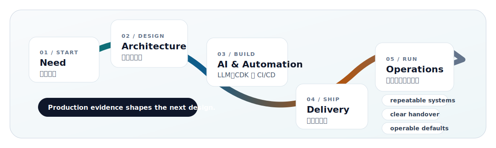

# Clarence Lin

**Cloud infrastructure, AI / LLM systems, AWS CDK, and DevOps automation** 
**雲端基礎架構、AI / LLM 系統、AWS CDK 與 DevOps 自動化**

I build cloud and AI-backed systems that can be repeated, operated, observed, and handed over clearly.

我專注把雲端架構、AI / LLM 應用、基礎設施程式碼、自動化交付與維運文件整合起來，讓系統不只可以上線，也能被團隊穩定接手與持續改善。

[![Website][website-badge]][website]
[![Blog][blog-badge]][blog]
[![LinkedIn][linkedin-badge]][linkedin]
[![X][x-badge]][x]
[![Facebook][facebook-badge]][facebook]

## How I Work / 工作方式

## Focus / 專注領域

| Area | Direction |
| --- | --- |
| Cloud infrastructure / 雲端基礎架構 | AWS architecture, repeatable environments, secure defaults, and maintainable IaC. |
| AI / LLM systems / AI 應用工程 | LLM-backed services, provider integration, local inference tooling, and operational guardrails. |
| DevOps automation / 自動化交付 | CI/CD, deployment hygiene, observability, and operational feedback loops. |
| Product engineering / 產品工程 | Practical backends, dashboards, payment integrations, and internal tools. |
| Knowledge sharing / 知識分享 | Technical writing, reusable examples, workshops, and clear engineering notes. |

## Selected Public Work / 精選公開作品

I keep this list curated: recent work, maintained work, or older repositories that still explain my cloud, AI, and DevOps direction. Recent private AI product work is not listed here.

這裡只放近期、仍有代表性，或能清楚說明我雲端、AI 與 DevOps 方向的公開專案；私有 AI 產品、太舊的 fork、封存實驗與一次性練習不放在主列表。

| Project | Why it is here |
| --- | --- |
| [clarencetw.github.io][repo-website] | Personal website and long-form profile home. / 個人網站與完整介紹入口。 |
| [nonroot-ollama][repo-nonroot-ollama] | Public AI infrastructure work for safer Ollama deployment. / 以非 root 容器方式改善 Ollama 部署安全性。 |
| [cdk-wordpress][repo-cdk-wordpress] | Representative AWS CDK infrastructure pattern. / 具代表性的 AWS CDK 基礎設施範例。 |

More AWS CDK references / 其他 AWS CDK 參考

- [cdk-lambda-layer-curl][repo-layer-curl]
- [cdk-lambda-layer-wget][repo-layer-wget]
- [cdk-lambda-layer-zip][repo-layer-zip]

## Writing / 寫作與分享

- Book: **AWS CDK 完全學習手冊：打造雲端基礎架構程式碼 IaC**
- Blog: [blog.clarence.tw][blog]
- Website: [clarence.tw][website]
- GitHub: [github.com/clarencetw][profile]

## Stack / 技術

![AWS][aws-badge]
![AWS CDK][cdk-badge]
![AI / LLM][ai-llm-badge]
![TypeScript][typescript-badge]
![Node.js][node-badge]
![Go][go-badge]
![PHP][php-badge]
![Docker][docker-badge]
![GitHub Actions][actions-badge]
![Cloudflare][cloudflare-badge]

## Automation / 自動更新

- `github-metrics.svg` is generated by GitHub Actions every day.
- Recent blog posts are pulled from [blog.clarence.tw][blog] through RSS in the metrics card.
- The project list above is curated manually, so stale repositories do not appear automatically.

## Activity Snapshot / 自動統計

[website-badge]: https://img.shields.io/badge/Website-clarence.tw-F38020?style=for-the-badge&logo=cloudflare&logoColor=white
[blog-badge]: https://img.shields.io/badge/Blog-blog.clarence.tw-21759B?style=for-the-badge&logo=wordpress&logoColor=white
[linkedin-badge]: https://img.shields.io/badge/LinkedIn-Clarence%20Lin-0077B5?style=for-the-badge&logo=linkedin&logoColor=white
[x-badge]: https://img.shields.io/badge/X-Clarence__Lin-000000?style=for-the-badge&logo=x&logoColor=white
[facebook-badge]: https://img.shields.io/badge/Facebook-ClarenceTaiwan-1877F2?style=for-the-badge&logo=facebook&logoColor=white

[aws-badge]: https://img.shields.io/badge/AWS-232F3E?style=flat-square&logo=amazonwebservices&logoColor=white
[cdk-badge]: https://img.shields.io/badge/AWS%20CDK-FF9900?style=flat-square&logo=amazonwebservices&logoColor=white
[ai-llm-badge]: https://img.shields.io/badge/AI%20%2F%20LLM-0F172A?style=flat-square&logo=openai&logoColor=white
[typescript-badge]: https://img.shields.io/badge/TypeScript-3178C6?style=flat-square&logo=typescript&logoColor=white
[node-badge]: https://img.shields.io/badge/Node.js-339933?style=flat-square&logo=nodedotjs&logoColor=white
[go-badge]: https://img.shields.io/badge/Go-00ADD8?style=flat-square&logo=go&logoColor=white
[php-badge]: https://img.shields.io/badge/PHP-777BB4?style=flat-square&logo=php&logoColor=white
[docker-badge]: https://img.shields.io/badge/Docker-2496ED?style=flat-square&logo=docker&logoColor=white
[actions-badge]: https://img.shields.io/badge/GitHub%20Actions-2088FF?style=flat-square&logo=githubactions&logoColor=white
[cloudflare-badge]: https://img.shields.io/badge/Cloudflare-F38020?style=flat-square&logo=cloudflare&logoColor=white

[linkedin]: https://www.linkedin.com/in/clarencetw/
[blog]: https://blog.clarence.tw/
[website]: https://clarence.tw/
[x]: https://twitter.com/Clarence_Lin/
[facebook]: https://www.facebook.com/ClarenceTaiwan/
[profile]: https://github.com/clarencetw

[repo-website]: https://github.com/clarencetw/clarencetw.github.io
[repo-nonroot-ollama]: https://github.com/clarencetw/nonroot-ollama
[repo-cdk-wordpress]: https://github.com/clarencetw/cdk-wordpress
[repo-layer-curl]: https://github.com/clarencetw/cdk-lambda-layer-curl
[repo-layer-wget]: https://github.com/clarencetw/cdk-lambda-layer-wget
[repo-layer-zip]: https://github.com/clarencetw/cdk-lambda-layer-zip
